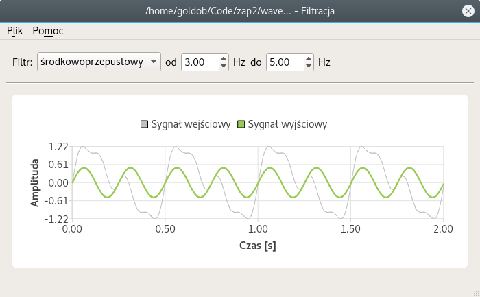

_**Quick disclaimer**: due to its original purpose, the applcation and its documentation were created in polish language. I do not intend to translate either in full or in any part and only provide this readme as a quick reference for those interested._

# Signal filtration

Qt5 application for visualising basic digital filters. Created as a course project at Warsaw University of Technology.



## Features

1. Open a [signal file](#signal-files) by drag-n-dropping it into the main area or going through  `Plik > Otwórz`
2. Apply one of the available filter types:
  - `dolnoprzepustowy` (low-pass),
  - `górnoprzepustowy` (high-pass),
  - `środkowoprzepustowy` (band-pass),
  - `środkowozaporowy` (band-stop).
3. Preview results and save filtered signal with `Plik > Zapisz` or `Plik > Zapisz jako...` (under new name).

## Signal files

Signal files used by the program are standard text files with a `.signal` extension. Example file might look like this:

```
128 4
0
0
0
0

```

First two numbers represent sampling frequency in hertz and the total number of samples [N]. Next N rows contains subsequent sample values.

It's trivial to see that the above example shows just a constant signal. For more interesting examples, see files located at `docs/examples` - you can use them as test input to the application.

## How to run it

The simplest way to get the application app and running is to install [Qt Creator](). You'll also need [QtCharts](https://doc.qt.io/qt-5/qtcharts-index.html) module and C++11 compiler, so make sure you have both.

From there, all you have to do is compile and run the application from within the IDE. Notice there are two build targets available: `Program graficzny`, which is a standard GUI version of the application and `Program konsolowy`, which is a simplified CLI version.

## License

MIT
